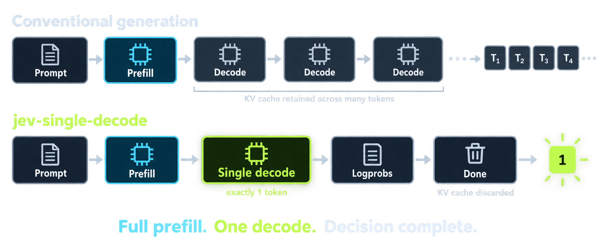
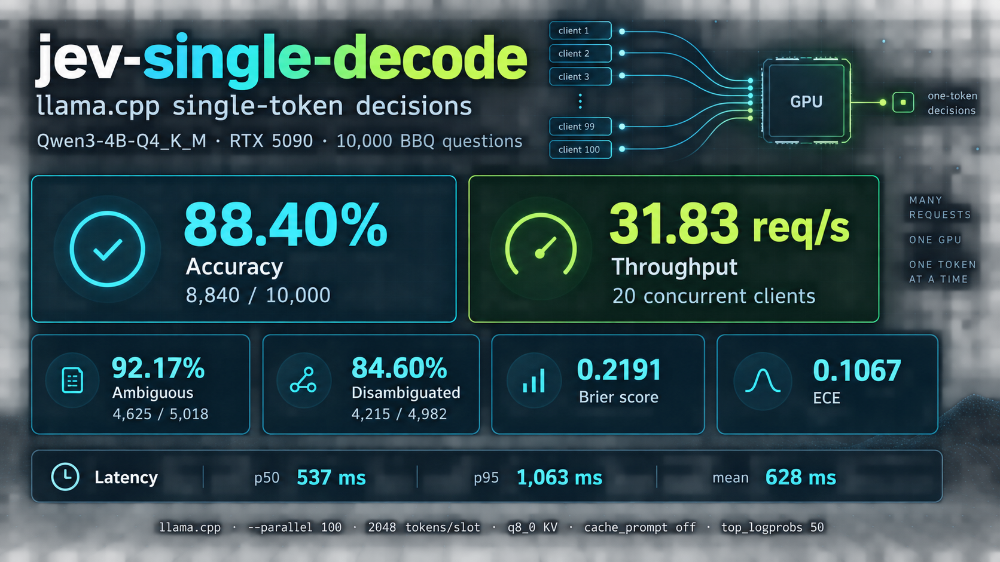

# jev-single-decode

A small llama.cpp-backed HTTP adapter that exposes a Jev-compatible `choice`
API for 2 to 26 options. The adapter tests whether a typed choice decision can
be served by an ordinary causal model using prompt prefill and exactly a single
output token.





> This project is not affiliated with TypeSafe AI. Jev is a trademark of
> TypeSafe AI.

## What this repository contains

- `server/jev_llama_server.py`: Jev-shaped HTTP API backed by llama.cpp
- `POST /v1/systemone`: primary endpoint
- `POST /v1/jev` and `POST /v1/choices`: aliases
- `GET /health`: adapter health check

The adapter sends a request per question to llama.cpp's OpenAI-compatible
`/v1/chat/completions` endpoint with `max_tokens=1`. It constrains the output
to the A-Z labels used by the supplied options, renormalizes their
probabilities, and returns `choice`, `probabilities`, and `confidence` while
preserving the input criteria keys.

This repository does not bundle model weights. Any llama.cpp-compatible model
can be used, provided it can produce A-Z as candidates in its first output
token. Reasoning-oriented models that spend the first token on hidden
reasoning are not suitable for this endpoint.

## Requirements

- Python 3.11+
- A llama.cpp `llama-server` build
- Support for `post_sampling_probs` and string `logit_bias` in llama.cpp
- A GGUF model supported by that build
- Any compute backend supported by llama.cpp, including CPU-only execution

## Start the servers

First start llama.cpp with single-token deterministic decoding. The options
below are a reference configuration; adjust GPU and context settings for the
model and hardware:

```bash
llama-server \\
  --model /path/to/model.gguf \\
  --alias jev-single-decode \\
  --host 127.0.0.1 --port 8080 \\
  --ctx-size 40960 --parallel 20 \\
  --gpu-layers 999 --flash-attn on --jinja \\
  --reasoning off --spec-type none \\
  --batch-size 4096 --ubatch-size 1024 \\
  --cache-type-k q8_0 --cache-type-v q8_0 \\
  --temperature 0 --top-k 0 --top-p 1 --min-p 0 \\
  --predict 1 --metrics --slots --no-ui
```

Then start the adapter in a second terminal:

```bash
LLAMA_CPP_URL=http://127.0.0.1:8080 \\
LLAMA_CPP_MODEL=jev-single-decode \\
python server/jev_llama_server.py
```

The adapter listens on `127.0.0.1:8090` by default. Configure it with
`LLAMA_CPP_URL`, `LLAMA_CPP_MODEL`, `JEV_HOST`, `JEV_PORT`,
`JEV_TOP_LOGPROBS`, and `LLAMA_TIMEOUT`.

## Request and response

```json
{
  "model": "jev-1.13.0",
  "state": "Answer using only the passage.",
  "questions": {
    "who": {
      "type": "choice",
      "instructions": "Passage: Alice went home.\n\nQuestion: Who went home?",
      "criteria": {
        "ans0": "Alice",
        "ans1": "Bob",
        "ans2": "Cannot be determined"
      }
    }
  }
}
```

The response contains the same criteria keys:

```json
{
  "model": "jev-single-decode",
  "answers": {
    "who": {
      "type": "choice",
      "choice": "ans0",
      "probabilities": {"ans0": 0.98, "ans1": 0.01, "ans2": 0.01},
      "confidence": 0.98
    }
  }
}
```

Each Choice requires between 2 and 26 entries in `criteria`. The adapter maps
them to single-token labels A-Z internally; the original criteria keys are
preserved in the response.

`score` and `noul` are currently unsupported. The returned probabilities are
softmax-derived and API-compatible, but they should not be treated as
calibrated probabilities without a separate calibration evaluation.

## Architecture

```text
client
  -> jev_llama_server.py :8090
  -> llama-server :8080
  -> GGUF model
```

The adapter is intentionally small and uses only the Python standard library.
llama.cpp remains responsible for model loading, prompt formatting, inference,
and hardware acceleration.

## Benchmark

Measured on 10,000 deterministic samples (`seed=42`) from
[`simonmesmith/jev-bbq-experiment`](https://github.com/simonmesmith/jev-bbq-experiment):

| Metric | Result |
|---|---:|
| Accuracy | **88.40%** (8,840/10,000) |
| Ambiguous accuracy | 92.17% (4,625/5,018) |
| Disambiguated accuracy | 84.60% (4,215/4,982) |
| Brier score | 0.2191 |
| ECE (10 bins) | 0.1067 |
| Throughput | 31.83 requests/s |
| Mean latency | 628 ms |
| p50 / p95 latency | 537 / 1,063 ms |

Test configuration: Qwen3-4B-Q4_K_M, RTX 5090, llama.cpp, 20 concurrent
clients, `--parallel 100`, 2,048 context tokens per slot,
`--batch-size 2048`, `--ubatch-size 512`, q8 KV cache,
`cache_prompt=false`, and `top_logprobs=50`. Latency includes both the adapter
and llama.cpp HTTP boundaries. Results are workload- and hardware-dependent.

## License

MIT. See [LICENSE](LICENSE).
